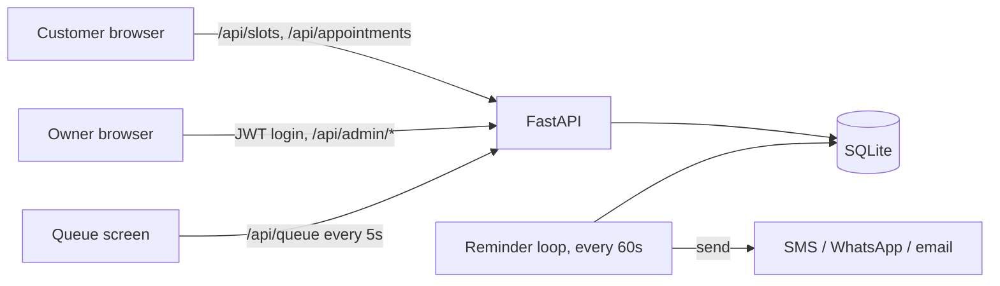

# QueueUp

Appointment booking and a live queue screen for small businesses: clinics, salons, repair shops, tutors. It replaces paper registers and WhatsApp back-and-forth.

**Live demo:** _add your deployed link here_  
**Used by:** _add the name of the real business that tries it_


## The problem

Small businesses book by phone call or WhatsApp. Slots get double-booked, customers forget and don't show up, and people crowd the waiting area because nobody knows who is next.

## Features

- **Customer booking page.** Pick a date and time, enter name and phone. No account needed.
- **Queue number.** Each slot has a fixed number, shown to the customer after booking.
- **Cancel from the booking confirmation.** Cancelling frees the slot straight away.
- **Owner dashboard.** Password login, daily list, confirm / no-show / cancel, and "Call next customer".
- **Live queue screen** (`/display.html`) for a TV or tablet. Updates every 5 seconds.
- **Reminders** sent before each appointment (console by default, pluggable for SMS/WhatsApp/email).
- **Reports.** Bookings for the last 7 days, busiest hours, no-show and cancellation counts.

## How it works



Design decisions worth knowing:

- **No double booking.** A partial unique index on `(date, time)` where `status != 'cancelled'` makes the database reject a second booking, even when two people click at the same moment. The API turns that into a friendly `409`.
- **Queue number = slot position.** 09:00 is number 1, 09:30 is number 2, and so on. "Call next" serves in time order, so numbers always go up.
- **Call next is one transaction.** Finishing the current customer and calling the next happen together.
- **Login is rate limited** (10 attempts per 15 minutes per IP) and uses a constant-time password comparison.

## Run it locally

```bash
git clone <your-repo-url> && cd queueup
python -m venv .venv && source .venv/bin/activate   # Windows: .venv\Scripts\activate
pip install -r requirements-dev.txt
cp .env.example .env        # then edit ADMIN_PASSWORD and JWT_SECRET
set -a && source .env && set +a    # Windows: set the variables manually
uvicorn app.main:create_app --factory --reload
```

Open:

| Page | URL |
|---|---|
| Customer booking | http://localhost:8000/ |
| Owner dashboard | http://localhost:8000/admin.html |
| Live queue screen | http://localhost:8000/display.html |
| API docs (Swagger) | http://localhost:8000/docs |

## Settings

| Variable | Default | Meaning |
|---|---|---|
| `ADMIN_PASSWORD` | `change-me` | Owner login password |
| `JWT_SECRET` | `dev-secret-change-me` | Use a long random string (32+ characters) |
| `DB_FILE` | `data/queueup.db` | SQLite file path |
| `OPEN_HOUR` / `CLOSE_HOUR` | `9` / `17` | Opening hours (24h) |
| `SLOT_MINUTES` | `30` | Length of each slot |
| `REMINDER_MINUTES` | `60` | How long before the slot to remind |
| `APP_ENV` | `development` | `production` refuses to start with default secrets |
| `TZ` | system | Set to your time zone, e.g. `Asia/Kolkata` |

## API

| Method | Path | Auth | Purpose |
|---|---|---|---|
| GET | `/api/slots?date=YYYY-MM-DD` | none | Slots and availability |
| POST | `/api/appointments` | none | Book a slot |
| POST | `/api/appointments/{id}/cancel` | phone number | Cancel own booking |
| GET | `/api/queue` | none | Now serving and number waiting |
| POST | `/api/admin/login` | password | Get a JWT |
| GET | `/api/admin/appointments?date=` | JWT | Day's bookings |
| PATCH | `/api/admin/appointments/{id}` | JWT | Change status |
| POST | `/api/admin/queue/next` | JWT | Finish current, call next |
| GET | `/api/admin/stats` | JWT | Reports |

## Tests

```bash
pytest -q
```

Covers double booking, cancellation, validation, admin auth, the queue flow, stats and reminders. GitHub Actions runs them on every push (`.github/workflows/ci.yml`).

## Deploy

**Docker**

```bash
docker build -t queueup .
docker run -p 8000:8000 -v queueup-data:/data \
  -e ADMIN_PASSWORD=your-password -e JWT_SECRET=$(openssl rand -hex 32) -e TZ=Asia/Kolkata queueup
```

**Render / Railway:** create a Web Service from this repo and use the Dockerfile. Add a persistent disk mounted at `/data`, and set `ADMIN_PASSWORD`, `JWT_SECRET` and `TZ`.

## Turn the reminders into real messages

Edit `console_send` in `app/reminders.py`. For example, with Twilio:

```python
from twilio.rest import Client
client = Client(SID, AUTH_TOKEN)
def send(phone, message):
    client.messages.create(to=phone, from_=FROM_NUMBER, body=message)
```

Then pass `send` into `run_reminders`.

## Roadmap

- OTP check on the phone number
- Multiple staff members / services
- PostgreSQL option for larger deployments
- Customer "where am I in the queue" page
- CSV export of bookings

## License

MIT
